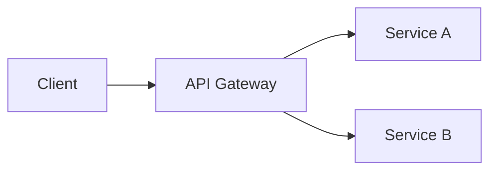

# dotnet-documentation-strategy

Documentation tooling recommendation for .NET projects: decision tree for selecting Starlight (Astro-based, modern default), Docusaurus (React-based, plugin-rich), or DocFX (community-maintained, .NET-native XML doc integration). Covers MarkdownSnippets for verified code inclusion from source files, Mermaid rendering support across all platforms, migration paths between tools, and project-context-driven recommendation based on team size, project type, and existing ecosystem.

**Version assumptions:** Starlight v0.x+ (Astro 4+). Docusaurus v3.x (React 18+). DocFX v2.x (community-maintained). MarkdownSnippets as `dotnet tool` (.NET 8.0+ baseline). Mermaid v10+ (GitHub, Starlight, Docusaurus render natively).

**Scope boundary:** This skill owns documentation tooling selection and configuration for .NET projects -- the decision of which doc platform to use, initial setup, and content authoring patterns. CI deployment of doc sites to GitHub Pages or other hosts is owned by [skill:dotnet-gha-deploy]. API reference documentation generation from XML comments is owned by [skill:dotnet-api-docs].

**Out of scope:** CI/CD deployment pipelines for doc sites (GitHub Pages workflows, Docker-based deployment) -- see [skill:dotnet-gha-deploy]. API documentation generation specifics (DocFX API reference setup, OpenAPI-as-docs) -- see [skill:dotnet-api-docs]. XML documentation comment authoring -- see [skill:dotnet-xml-docs]. Mermaid diagram syntax and .NET-specific diagram patterns -- see [skill:dotnet-mermaid-diagrams].

Cross-references: [skill:dotnet-gha-deploy] for doc site deployment pipelines, [skill:dotnet-api-docs] for API reference generation, [skill:dotnet-xml-docs] for XML doc comment authoring, [skill:dotnet-mermaid-diagrams] for .NET-specific Mermaid diagrams.

---

## Documentation Tooling Decision Tree

Choose documentation tooling based on project context, team capabilities, and existing ecosystem investments.

### Quick Decision Matrix

| Factor | Starlight | Docusaurus | DocFX |
|--------|-----------|------------|-------|
| Best for | New projects, static docs | React teams, blog + docs | Existing .NET projects with XML docs |
| Learning curve | Low (Markdown + MDX) | Medium (React + MDX) | Medium (.NET toolchain) |
| Built-in search | Yes (Pagefind) | Yes (Algolia plugin) | Yes (Lunr.js) |
| Versioned docs | Yes (manual setup) | Yes (built-in) | Yes (built-in) |
| i18n support | Yes (built-in) | Yes (built-in) | Limited |
| Mermaid support | Native (remark plugin) | Native (MDX plugin) | Plugin required |
| API reference from XML | Manual integration | Manual integration | Native (`docfx metadata`) |
| Hosting | Any static host | Any static host | Any static host |
| Build speed | Fast (Astro) | Moderate (Webpack/Rspack) | Moderate (.NET toolchain) |

### Decision Flowchart

```
Start: New documentation site for .NET project
  |
  +-- Do you have existing DocFX content?
  |     |
  |     +-- Yes --> Do you need XML doc API reference integration?
  |     |            |
  |     |            +-- Yes --> Stay with DocFX (lowest migration cost)
  |     |            |
  |     |            +-- No --> Migrate to Starlight (see Migration Paths below)
  |     |
  |     +-- No --> Is your team heavily invested in React?
  |                 |
  |                 +-- Yes --> Docusaurus (leverage React skills, plugin ecosystem)
  |                 |
  |                 +-- No --> Starlight (modern default, best DX)
```

### Project Context Factors

**Library vs Application:**
- Libraries benefit from API reference integration -- DocFX excels here with `docfx metadata` generating API docs directly from XML comments
- Applications typically need guides, tutorials, and architectural docs -- Starlight or Docusaurus are better fits
- Hybrid (library + app docs) -- consider Starlight with separate API reference section linking to DocFX-generated content

**Team Size:**
- Solo / small team (1-3): Starlight -- minimal configuration, fast iteration
- Medium team (4-10): Starlight or Docusaurus -- both handle multiple contributors well with built-in versioning
- Large team (10+): Docusaurus -- plugin ecosystem handles complex multi-author workflows, custom review integrations

**Existing Ecosystem:**
- React ecosystem: Docusaurus integrates naturally with existing React component libraries and storybook
- .NET-only toolchain: DocFX avoids JavaScript build dependencies entirely
- Polyglot / modern: Starlight works with any tech stack, minimal JavaScript knowledge required

---

## Starlight (Astro-Based) -- Modern Default

Starlight is an Astro-based documentation framework. It is the recommended default for new .NET documentation sites due to fast build times, built-in search (Pagefind), i18n, and native Mermaid support.

### Initial Setup

```bash
# Create a new Starlight project
npm create astro@latest -- --template starlight my-docs

cd my-docs
npm install
npm run dev
```

### Project Structure

```
my-docs/
  astro.config.mjs      # Starlight configuration
  src/
    content/
      docs/              # Markdown/MDX documentation pages
        index.mdx        # Landing page
        getting-started/
          installation.md
          quick-start.md
        guides/
          configuration.md
          architecture.md
        reference/
          api.md
          cli.md
    assets/              # Images, diagrams
  public/                # Static assets (favicon, robots.txt)
```

### Configuration

```javascript
// astro.config.mjs
import { defineConfig } from 'astro/config';
import starlight from '@astrojs/starlight';

export default defineConfig({
  integrations: [
    starlight({
      title: 'My .NET Library',
      social: {
        github: 'https://github.com/mycompany/my-library',
      },
      sidebar: [
        {
          label: 'Getting Started',
          items: [
            { label: 'Installation', slug: 'getting-started/installation' },
            { label: 'Quick Start', slug: 'getting-started/quick-start' },
          ],
        },
        {
          label: 'Guides',
          autogenerate: { directory: 'guides' },
        },
        {
          label: 'Reference',
          autogenerate: { directory: 'reference' },
        },
      ],
    }),
  ],
});
```

### Mermaid Support in Starlight

```bash
# Install Mermaid remark plugin
npm install remark-mermaidjs
```

```javascript
// astro.config.mjs
import remarkMermaid from 'remark-mermaidjs';

export default defineConfig({
  markdown: {
    remarkPlugins: [remarkMermaid],
  },
  integrations: [starlight({ /* ... */ })],
});
```

After configuration, use standard Mermaid fenced code blocks in any Markdown file. See [skill:dotnet-mermaid-diagrams] for .NET-specific diagram patterns.

### Versioned Documentation

Use the `@lorenzo_lewis/starlight-utils` plugin for version dropdown navigation -- this is the recommended approach for Starlight versioned docs.

Alternatively, use directory-based versioning with explicit routing in `astro.config.mjs`:

```
src/content/docs/
  v1/
    getting-started.md
    api-reference.md
  v2/
    getting-started.md
    api-reference.md
```

Configure the sidebar to point to the current version directory and add a version selector via the plugin or custom Astro component.

---

## Docusaurus (React-Based)

Docusaurus is a React-based documentation framework maintained by Meta. It is a strong choice for teams already invested in the React ecosystem, offering a rich plugin system, built-in blog, and versioned docs.

### Initial Setup

```bash
npx create-docusaurus@latest my-docs classic

cd my-docs
npm install
npm start
```

### Project Structure

```
my-docs/
  docusaurus.config.js   # Docusaurus configuration
  docs/                   # Markdown/MDX documentation
    intro.md
    getting-started/
      installation.md
    guides/
      configuration.md
  blog/                   # Optional blog posts
  src/
    components/           # Custom React components
    pages/                # Custom pages
  static/                 # Static assets
  sidebars.js             # Sidebar configuration
```

### Configuration

```javascript
// docusaurus.config.js
/** @type {import('@docusaurus/types').Config} */
const config = {
  title: 'My .NET Library',
  tagline: 'High-performance widgets for .NET',
  url: 'https://mycompany.github.io',
  baseUrl: '/my-library/',
  organizationName: 'mycompany',
  projectName: 'my-library',

  presets: [
    [
      'classic',
      /** @type {import('@docusaurus/preset-classic').Options} */
      ({
        docs: {
          sidebarPath: require.resolve('./sidebars.js'),
          editUrl: 'https://github.com/mycompany/my-library/tree/main/docs/',
        },
        blog: {
          showReadingTime: true,
        },
        theme: {
          customCss: require.resolve('./src/css/custom.css'),
        },
      }),
    ],
  ],
};

module.exports = config;
```

### Mermaid Support in Docusaurus

```bash
npm install @docusaurus/theme-mermaid
```

```javascript
// docusaurus.config.js
const config = {
  markdown: {
    mermaid: true,
  },
  themes: ['@docusaurus/theme-mermaid'],
  // ...
};
```

### Versioned Documentation

Docusaurus has first-class versioning support:

```bash
# Snapshot current docs as a version
npx docusaurus docs:version 1.0

# Creates versioned_docs/version-1.0/ and versions.json
```

This creates a snapshot of the current `docs/` directory. The `docs/` directory continues to represent the "next" unreleased version.

---

## DocFX (Community-Maintained, .NET-Native)

DocFX is a .NET-native documentation generator that integrates directly with XML documentation comments. Microsoft dropped official support in November 2022, and the project is now community-maintained. It remains widely used in the .NET ecosystem, particularly for projects with heavy API reference documentation needs.

### Initial Setup

```bash
# Install DocFX as a .NET tool
dotnet tool install -g docfx

# Initialize a new DocFX project
docfx init

# Build the documentation
docfx build

# Serve locally
docfx serve _site
```

### Project Structure

```
docs/
  docfx.json              # DocFX configuration
  toc.yml                 # Table of contents
  index.md                # Landing page
  articles/               # Conceptual documentation
    getting-started.md
    configuration.md
  api/                    # Auto-generated API reference
    .gitignore            # Generated files excluded from source control
  images/                 # Static assets
  templates/              # Custom templates (optional)
```

### Configuration

```json
{
  "metadata": [
    {
      "src": [
        {
          "files": ["src/MyLibrary/MyLibrary.csproj"],
          "src": ".."
        }
      ],
      "dest": "api",
      "properties": {
        "TargetFramework": "net8.0"
      }
    }
  ],
  "build": {
    "content": [
      {
        "files": ["api/**.yml", "api/index.md"]
      },
      {
        "files": ["articles/**.md", "toc.yml", "*.md"]
      }
    ],
    "resource": [
      {
        "files": ["images/**"]
      }
    ],
    "dest": "_site",
    "globalMetadata": {
      "_appTitle": "My .NET Library",
      "_enableSearch": true
    }
  }
}
```

### XML Doc Integration

DocFX's primary advantage is native API reference generation from XML documentation comments:

```bash
# Generate API metadata from project XML docs
docfx metadata docfx.json

# This creates YAML files in the api/ directory
# representing all public types, methods, and properties
```

The generated API reference automatically links to conceptual articles via `uid` cross-references. See [skill:dotnet-xml-docs] for XML documentation comment authoring best practices.

### Mermaid Support in DocFX

DocFX requires a template plugin for Mermaid rendering:

```json
{
  "build": {
    "globalMetadata": {
      "_enableMermaid": true
    },
    "template": ["default", "modern"],
    "postProcessors": ["ExtractSearchIndex"]
  }
}
```

The `modern` template includes Mermaid support since DocFX v2.75+. Earlier versions require a custom template extension. Note that `_enableMermaid` is a template-specific convention, not an officially documented DocFX property. For the `default` template, add the Mermaid JavaScript library via a custom template extension.

---

## MarkdownSnippets -- Verified Code Inclusion

MarkdownSnippets is a `dotnet tool` that includes verified code snippets from actual source files into Markdown documentation. This eliminates stale code examples by keeping documentation in sync with compilable source code.

### Installation

```bash
# Install as a local dotnet tool
dotnet new tool-manifest
dotnet tool install MarkdownSnippets.Tool

# Or install globally
dotnet tool install -g MarkdownSnippets.Tool
```

### Usage

**1. Mark code regions in source files with `#region` directives:**

```csharp
// src/MyLibrary/WidgetService.cs
public class WidgetService
{
    #region CreateWidget
    public async Task<Widget> CreateWidgetAsync(string name, CancellationToken ct = default)
    {
        ArgumentException.ThrowIfNullOrWhiteSpace(name);

        var widget = new Widget { Name = name, CreatedAt = DateTimeOffset.UtcNow };
        await _repository.AddAsync(widget, ct);
        return widget;
    }
    #endregion
}
```

**2. Reference snippets in Markdown:**

```markdown
## Creating a Widget

To create a widget, use the `CreateWidgetAsync` method:

<!-- snippet: CreateWidget -->
<!-- endSnippet -->
```

**3. Run MarkdownSnippets to inject the code:**

```bash
dotnet tool run mdsnippets
```

This replaces the snippet placeholder with the actual code from the source file, keeping the documentation in sync with the implementation.

### Configuration

```json
// mdsnippets.json (project root)
{
  "Convention": "InPlaceOverwrite",
  "ReadOnly": false,
  "LinkFormat": "GitHub",
  "UrlPrefix": "https://github.com/mycompany/my-library/blob/main",
  "TocExcludes": ["**/obj/**", "**/bin/**"],
  "ExcludeDirectories": ["node_modules", ".git"]
}
```

### Integration with Doc Platforms

MarkdownSnippets works with all three documentation platforms since it operates on standard Markdown files before the platform build step:

```bash
# In your build script or CI pipeline:
dotnet tool run mdsnippets    # 1. Inject verified snippets
npm run build                 # 2. Build Starlight/Docusaurus site

# For DocFX:
dotnet tool run mdsnippets    # 1. Inject verified snippets
docfx build                   # 2. Build DocFX site
```

---

## Mermaid Rendering Across Platforms

All three recommended documentation platforms support Mermaid diagrams, and GitHub renders Mermaid natively in Markdown files.

| Platform | Mermaid Support | Setup Required |
|----------|----------------|----------------|
| GitHub | Native | None -- fenced code blocks with `mermaid` language |
| Starlight | Plugin | `remark-mermaidjs` npm package |
| Docusaurus | Plugin | `@docusaurus/theme-mermaid` + config flag |
| DocFX | Template | `modern` template or custom template extension |

Use standard fenced code blocks with the `mermaid` language identifier across all platforms:

````markdown

````

See [skill:dotnet-mermaid-diagrams] for .NET-specific diagram types (C4 architecture, async patterns, EF Core models, DI graphs).

---

## Migration Paths

### DocFX to Starlight

DocFX-to-Starlight migration is the most common path for .NET projects modernizing their documentation.

**Content migration:**
1. Copy `articles/` Markdown files to `src/content/docs/`
2. Convert `toc.yml` entries to Starlight sidebar configuration in `astro.config.mjs`
3. Replace DocFX-specific metadata YAML headers with Starlight frontmatter
4. Convert `xref` cross-references to standard Markdown links
5. Replace `> [!NOTE]` / `> [!WARNING]` callout syntax with Starlight `<Aside>` components (or keep GitHub-compatible blockquote syntax)

**API reference migration:**
- DocFX `docfx metadata` output (YAML files) has no direct Starlight equivalent
- Option A: Continue running `docfx metadata` and host API reference as a separate subsite
- Option B: Use TypeDoc-style API extraction tools and convert to Markdown pages
- Option C: Link to hosted API reference on a separate URL

**Checklist:**

```bash
# Find all DocFX-specific syntax to convert
grep -rn "xref:" articles/                # Cross-references
grep -rn "\[!NOTE\]" articles/            # Callout syntax
grep -rn "\[!WARNING\]" articles/         # Callout syntax
grep -rn "^\s*uid:" articles/             # UID metadata
```

### Docusaurus to Starlight

**Content migration:**
1. Copy `docs/` Markdown files to `src/content/docs/`
2. Convert `sidebars.js` to Starlight sidebar configuration
3. Replace Docusaurus-specific MDX components (`<Tabs>`, `<TabItem>`) with Starlight equivalents
4. Convert `docusaurus.config.js` navigation to Starlight config
5. Migrate custom React components if used in MDX (Starlight supports Astro components and limited React via `@astrojs/react`)

**Blog migration:**
- Starlight does not have a built-in blog -- use the `starlight-blog` community plugin or maintain a separate Astro blog section

---

## Agent Gotchas

1. **Recommend Starlight as the modern default** -- unless the project has an existing DocFX site with heavy XML doc integration or the team is deeply invested in React (Docusaurus). Do not recommend DocFX for new projects without XML doc API reference needs.

2. **DocFX is community-maintained since November 2022** -- Microsoft transferred the repository to the community. It is still actively maintained and widely used, but new projects should evaluate Starlight or Docusaurus first.

3. **MarkdownSnippets runs BEFORE the doc platform build** -- it is a pre-processing step that modifies Markdown files in place. Always run `dotnet tool run mdsnippets` before `npm run build` (Starlight/Docusaurus) or `docfx build` (DocFX).

4. **Do not generate CI deployment YAML** -- doc site deployment workflows belong to [skill:dotnet-gha-deploy]. This skill covers tooling selection and local authoring setup only.

5. **Do not generate API reference configuration** -- DocFX API reference setup, OpenAPI-as-documentation patterns, and doc-code sync belong to [skill:dotnet-api-docs]. This skill helps choose the platform, not configure API reference generation.

6. **Mermaid fenced code blocks work identically across GitHub, Starlight, and Docusaurus** -- use the same `mermaid` language identifier everywhere. Only DocFX requires additional template configuration.

7. **MarkdownSnippets `#region` names must be unique across the entire solution** -- duplicate region names cause ambiguous snippet resolution. Use descriptive names like `CreateWidgetAsync` not generic names like `Example1`.

8. **Starlight versioning is directory-based, not command-based** -- unlike Docusaurus (`npx docusaurus docs:version`), Starlight uses directory structure or community plugins for versioning. Do not suggest Docusaurus versioning commands for Starlight projects.
