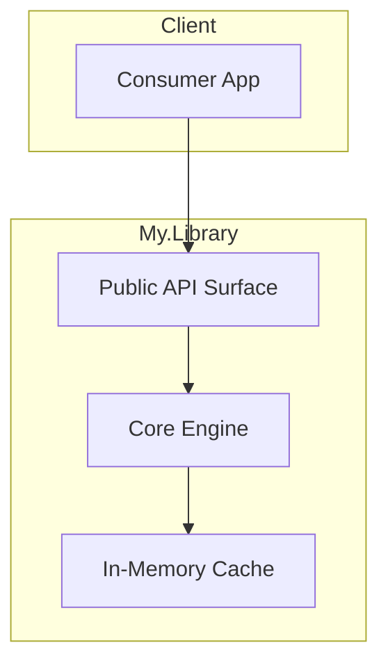

# dotnet-github-docs

GitHub-native documentation patterns for .NET projects: README structure with NuGet/CI/coverage badges and installation instructions, CONTRIBUTING.md with fork-PR workflow and development setup, issue templates (bug report with .NET version and repro steps, feature request with problem/solution/alternatives), PR templates with testing checklist and breaking changes section, GitHub Pages setup for documentation sites, repository metadata (CODEOWNERS, FUNDING.yml, social preview, topics/tags), and Mermaid diagram embedding in README files.

**Version assumptions:** .NET 8.0+ baseline for code examples. GitHub Actions for CI badges. NuGet.org for package badges.

**Scope boundary:** This skill owns GitHub-native documentation structure and templates for .NET projects -- the files that live in a repository root and `.github/` directory. CI/CD deployment pipelines for GitHub Pages sites are owned by [skill:dotnet-gha-deploy]. Changelog generation and versioning conventions are owned by [skill:dotnet-release-management]. Documentation tooling selection (Starlight, Docusaurus, DocFX) is owned by [skill:dotnet-documentation-strategy]. Mermaid diagram syntax and .NET-specific diagram patterns are owned by [skill:dotnet-mermaid-diagrams].

**Out of scope:** CI/CD deployment workflows for GitHub Pages or doc sites -- see [skill:dotnet-gha-deploy]. Changelog generation and release versioning -- see [skill:dotnet-release-management]. Documentation platform selection and configuration -- see [skill:dotnet-documentation-strategy]. Mermaid diagram syntax details -- see [skill:dotnet-mermaid-diagrams]. Project file structure and solution organization -- see [skill:dotnet-project-structure].

Cross-references: [skill:dotnet-gha-deploy] for GitHub Pages deployment pipelines, [skill:dotnet-release-management] for changelog format and versioning, [skill:dotnet-mermaid-diagrams] for .NET-specific Mermaid diagrams in READMEs, [skill:dotnet-project-structure] for project metadata context, [skill:dotnet-documentation-strategy] for doc platform selection.

---

## README Structure for .NET Projects

A well-structured README provides immediate context for contributors and consumers of a .NET project.

### Badges

Place badges at the top of the README, grouped by category:

```markdown
# My.Library

[](https://www.nuget.org/packages/My.Library)
[](https://www.nuget.org/packages/My.Library)
[](https://github.com/mycompany/my-library/actions/workflows/ci.yml)
[](https://codecov.io/gh/mycompany/my-library)
[](https://opensource.org/licenses/MIT)
```

**Badge categories for .NET projects:**

| Badge | Source | Notes |
|-------|--------|-------|
| NuGet version | shields.io + nuget.org | Use package ID, not assembly name |
| NuGet downloads | shields.io + nuget.org | Shows adoption; use `dt` for total downloads |
| Build status | GitHub Actions | Link to the CI workflow |
| Code coverage | Codecov / Coveralls | Requires CI integration |
| License | shields.io | Match the license in the repo |
| .NET version | shields.io | Optional; shows minimum supported TFM |

### Recommended README Sections

````markdown
# My.Library

[badges here]

Short one-paragraph description of what the library does and why it exists.

## Installation

```shell
dotnet add package My.Library
```

Or via PackageReference in your `.csproj`:

```xml
<PackageReference Include="My.Library" Version="1.0.0" />
```

## Quick Start

```csharp
using My.Library;

var service = new WidgetService();
var widget = await service.CreateWidgetAsync("example");
Console.WriteLine(widget.Id);
```

## Features

- Feature 1: brief description
- Feature 2: brief description
- Feature 3: brief description

## Documentation

Full documentation is available at [https://mycompany.github.io/my-library](https://mycompany.github.io/my-library).

## Architecture

[Mermaid architecture diagram -- see [skill:dotnet-mermaid-diagrams] for patterns]

## Contributing

Please read [CONTRIBUTING.md](CONTRIBUTING.md) for details on our code of conduct and the process for submitting pull requests.

## License

This project is licensed under the MIT License - see the [LICENSE](LICENSE) file for details.

## Changelog

See [CHANGELOG.md](CHANGELOG.md) for a history of changes. For changelog format conventions, see [skill:dotnet-release-management].
````

### Architecture Diagram in README

Embed a Mermaid architecture diagram directly in the README for visual context. GitHub renders Mermaid fenced code blocks natively:

````markdown
## Architecture


````

See [skill:dotnet-mermaid-diagrams] for .NET-specific diagram patterns including C4-style architecture, sequence diagrams for API flows, and class diagrams for domain models.

---

## CONTRIBUTING.md Patterns

### Fork-PR Workflow

```markdown
# Contributing to My.Library

Thank you for your interest in contributing! This document provides guidelines
and instructions for contributing.

## Getting Started

1. Fork the repository
2. Clone your fork: `git clone https://github.com/YOUR-USERNAME/my-library.git`
3. Create a feature branch: `git checkout -b feature/my-feature`
4. Make your changes
5. Submit a pull request

## Development Setup

### Prerequisites

- [.NET 8.0 SDK](https://dotnet.microsoft.com/download/dotnet/8.0) or later
- An IDE: [Visual Studio 2022](https://visualstudio.microsoft.com/), [VS Code](https://code.visualstudio.com/) with C# Dev Kit, or [JetBrains Rider](https://www.jetbrains.com/rider/)

### Building

```shell
dotnet restore
dotnet build
```

### Running Tests

```shell
dotnet test
```

To run tests with coverage:

```shell
dotnet test --collect:"XPlat Code Coverage"
```

### Coding Standards

- Follow the [.NET coding conventions](https://learn.microsoft.com/en-us/dotnet/csharp/fundamentals/coding-style/coding-conventions)
- Use `dotnet format` to enforce code style before committing
- All public APIs must have XML documentation comments
- New features must include unit tests

## Pull Request Process

1. Update documentation for any changed public APIs
2. Add or update tests to cover your changes
3. Ensure all tests pass: `dotnet test`
4. Ensure code compiles without warnings: `dotnet build -warnaserror`
5. Update the CHANGELOG.md with your changes under the `[Unreleased]` section
6. The PR will be reviewed by a maintainer

## Reporting Issues

- Use the [Bug Report](.github/ISSUE_TEMPLATE/bug_report.md) template for bugs
- Use the [Feature Request](.github/ISSUE_TEMPLATE/feature_request.md) template for enhancements
```

---

## Issue Templates

### Bug Report Template

```yaml
# .github/ISSUE_TEMPLATE/bug_report.yml
name: Bug Report
description: Report a bug in the library
title: "[Bug]: "
labels: ["bug", "triage"]
body:
  - type: markdown
    attributes:
      value: |
        Thank you for reporting a bug. Please fill out the information below
        to help us diagnose and fix the issue.

  - type: textarea
    id: description
    attributes:
      label: Description
      description: A clear and concise description of the bug.
    validations:
      required: true

  - type: textarea
    id: repro-steps
    attributes:
      label: Steps to Reproduce
      description: Steps to reproduce the behavior.
      value: |
        1. Install package version X
        2. Call method Y with parameters Z
        3. Observe error
    validations:
      required: true

  - type: textarea
    id: expected
    attributes:
      label: Expected Behavior
      description: What you expected to happen.
    validations:
      required: true

  - type: textarea
    id: actual
    attributes:
      label: Actual Behavior
      description: What actually happened. Include any error messages or stack traces.
    validations:
      required: true

  - type: input
    id: dotnet-version
    attributes:
      label: .NET Version
      description: "Output of `dotnet --version`"
      placeholder: "8.0.100"
    validations:
      required: true

  - type: dropdown
    id: os
    attributes:
      label: Operating System
      options:
        - Windows
        - macOS
        - Linux
    validations:
      required: true

  - type: textarea
    id: additional
    attributes:
      label: Additional Context
      description: Any other context about the problem (project type, related packages, etc.)
```

### Feature Request Template

```yaml
# .github/ISSUE_TEMPLATE/feature_request.yml
name: Feature Request
description: Suggest a new feature or enhancement
title: "[Feature]: "
labels: ["enhancement"]
body:
  - type: textarea
    id: problem
    attributes:
      label: Problem Statement
      description: Describe the problem this feature would solve.
      placeholder: "I'm always frustrated when..."
    validations:
      required: true

  - type: textarea
    id: solution
    attributes:
      label: Proposed Solution
      description: Describe the solution you'd like to see.
    validations:
      required: true

  - type: textarea
    id: alternatives
    attributes:
      label: Alternatives Considered
      description: Describe any alternative solutions or features you've considered.

  - type: textarea
    id: api-surface
    attributes:
      label: API Surface (if applicable)
      description: |
        If you have a proposed API design, include it here.
      render: csharp
```

### Question / Discussion Template

```yaml
# .github/ISSUE_TEMPLATE/question.yml
name: Question
description: Ask a question about using the library
title: "[Question]: "
labels: ["question"]
body:
  - type: textarea
    id: question
    attributes:
      label: Question
      description: What would you like to know?
    validations:
      required: true

  - type: textarea
    id: context
    attributes:
      label: Context
      description: |
        Provide context about what you're trying to accomplish.
        Include code snippets if relevant.
      render: csharp
```

### Issue Template Config

```yaml
# .github/ISSUE_TEMPLATE/config.yml
blank_issues_enabled: false
contact_links:
  - name: Discussions
    url: https://github.com/mycompany/my-library/discussions
    about: Use discussions for general questions and community support
  - name: Stack Overflow
    url: https://stackoverflow.com/questions/tagged/my-library
    about: Search for existing answers on Stack Overflow
```

---

## PR Templates

### Pull Request Template

```markdown
<!-- .github/pull_request_template.md -->

## Description

<!-- Briefly describe the changes in this PR -->

## Type of Change

- [ ] Bug fix (non-breaking change that fixes an issue)
- [ ] New feature (non-breaking change that adds functionality)
- [ ] Breaking change (fix or feature that would cause existing functionality to change)
- [ ] Documentation update
- [ ] Refactoring (no functional changes)
- [ ] Performance improvement

## Testing Checklist

- [ ] Unit tests added/updated
- [ ] Integration tests added/updated (if applicable)
- [ ] All existing tests pass (`dotnet test`)
- [ ] Code compiles without warnings (`dotnet build -warnaserror`)

## Breaking Changes

<!-- If this PR introduces breaking changes, describe them here and explain the migration path -->

N/A

## Related Issues

<!-- Link related issues using GitHub keywords: Fixes #123, Closes #456 -->

## Additional Notes

<!-- Any additional information that reviewers should know -->
```

---

## GitHub Pages Setup

GitHub Pages can host documentation sites generated by Starlight, Docusaurus, or DocFX. This section covers the repository configuration; CI deployment pipeline configuration belongs to [skill:dotnet-gha-deploy].

### Repository Settings

1. Navigate to **Settings > Pages**
2. Under **Source**, select **GitHub Actions** (not the legacy branch-based deployment)
3. The deployment workflow in `.github/workflows/` handles the build and publish steps

### Doc Site Directory Structure

Place documentation source files in a `docs/` directory at the repository root:

```
my-library/
  src/
    MyLibrary/
      MyLibrary.csproj
  docs/
    astro.config.mjs          # For Starlight
    # OR docusaurus.config.js  # For Docusaurus
    # OR docfx.json            # For DocFX
  .github/
    workflows/
      deploy-docs.yml          # Deployment workflow -- see [skill:dotnet-gha-deploy]
  README.md
  CONTRIBUTING.md
```

### Custom Domain

Configure a custom domain for GitHub Pages:

1. Add a `CNAME` file in the doc site's static directory (e.g., `docs/public/CNAME` for Starlight, `docs/static/CNAME` for Docusaurus)
2. Set the domain in **Settings > Pages > Custom domain**
3. Enable **Enforce HTTPS**

Content in the `CNAME` file:

```
docs.mylibrary.dev
```

For documentation platform selection and configuration, see [skill:dotnet-documentation-strategy]. For deployment workflow YAML, see [skill:dotnet-gha-deploy].

---

## Repository Metadata

### CODEOWNERS

Define code ownership for automated review assignment:

```
# .github/CODEOWNERS

# Default owner for everything
* @mycompany/core-team

# Documentation
/docs/ @mycompany/docs-team
*.md @mycompany/docs-team

# Source code by area
/src/MyLibrary.Core/ @mycompany/core-team
/src/MyLibrary.Data/ @mycompany/data-team

# Build and CI
/.github/ @mycompany/devops-team
/build/ @mycompany/devops-team
*.props @mycompany/core-team
*.targets @mycompany/core-team

# NuGet configuration
nuget.config @mycompany/core-team
Directory.Packages.props @mycompany/core-team
```

### FUNDING.yml

Configure GitHub Sponsors and other funding links:

```yaml
# .github/FUNDING.yml
github: [maintainer-username]
open_collective: my-library
custom: ["https://www.buymeacoffee.com/maintainer"]
```

### Social Preview

- Navigate to **Settings > General > Social preview**
- Upload a 1280x640 image (2:1 aspect ratio)
- Include: project name, logo, brief tagline, and .NET version badge
- Use a consistent brand color scheme

### Topics and Tags

Add repository topics for discoverability:

- `dotnet`, `csharp`, `nuget` -- ecosystem tags
- `library`, `sdk`, `framework` -- project type
- `aspnetcore`, `efcore`, `blazor` -- technology-specific tags
- Descriptive tags: `serialization`, `logging`, `dependency-injection`, etc.

Set topics in **Settings > General > Topics** or via the repository description area on the main page.

### Repository Description

Keep the repository description concise (under 350 characters). Include:
- What the project does
- Key differentiator or primary use case
- Target .NET version if relevant

Example: "High-performance JSON serialization library for .NET 8+ with source generator support and AOT compatibility."

---

## Agent Gotchas

1. **Always use YAML-based issue templates (`.yml`), not Markdown templates (`.md`)** -- YAML templates provide structured form fields with validation, dropdowns, and required fields. Markdown templates are the legacy format and offer no input validation.

2. **The `.github/ISSUE_TEMPLATE/` directory must contain a `config.yml`** -- without it, the "blank issue" option appears by default. Set `blank_issues_enabled: false` to force users through templates.

3. **Badge URLs must use the correct NuGet package ID** -- the package ID is case-sensitive on shields.io. Use the exact ID from NuGet.org (e.g., `Newtonsoft.Json`, not `newtonsoft.json`).

4. **CODEOWNERS patterns follow `.gitignore` syntax** -- use `/src/` for root-relative paths. Without the leading `/`, the pattern matches anywhere in the tree.

5. **GitHub Pages source must be set to "GitHub Actions"** -- the legacy "Deploy from a branch" mode does not support custom build steps. The GitHub Actions source delegates build and deployment to a workflow. For the workflow YAML, see [skill:dotnet-gha-deploy].

6. **Do not generate CI/CD deployment YAML in this skill** -- deployment workflows for GitHub Pages belong to [skill:dotnet-gha-deploy]. This skill covers repository structure and template content only.

7. **Do not generate changelog content** -- changelog format, versioning strategy, and release notes belong to [skill:dotnet-release-management]. Reference CHANGELOG.md in the README but do not define its format here.

8. **PR template file must be named exactly `pull_request_template.md`** -- GitHub only recognizes this exact filename (case-insensitive). It can live in the root, `docs/`, or `.github/` directory. The `.github/` location is recommended for consistency with issue templates.

9. **Include `.NET Version` in bug report templates** -- .NET version is critical for reproducing bugs. Use `dotnet --version` output as the expected format. Include OS as a dropdown since behavior often varies across platforms.

10. **Mermaid diagrams in README render natively on GitHub** -- no special configuration is needed. Use standard fenced code blocks with the `mermaid` language identifier. See [skill:dotnet-mermaid-diagrams] for .NET-specific diagram patterns to embed in architecture sections.
