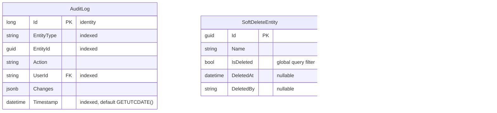

# dotnet-mermaid-diagrams

Mermaid diagram reference for .NET projects: architecture diagrams (C4-style context, container, component views, layered architecture, microservice topology), sequence diagrams (API request flows, async/await patterns, middleware pipeline, authentication flows), class diagrams (domain models, DI registration graphs, inheritance hierarchies, interface implementations), deployment diagrams (container deployment, Kubernetes pod layout, CI/CD pipeline flow), ER diagrams (EF Core model relationships, database schema visualization), state diagrams (workflow states, order processing, saga patterns, state machine patterns), and flowcharts (decision trees, framework selection, architecture choices). Includes diagram-as-code conventions for naming, grouping, GitHub rendering, and dark mode considerations.

**Version assumptions:** Mermaid v10+ (supported by GitHub, Starlight, Docusaurus natively). GitHub renders Mermaid in Markdown files, issues, PRs, and discussions. .NET 8.0+ baseline for code examples.

**Scope boundary:** This skill owns Mermaid diagram syntax and .NET-specific diagram patterns -- the actual diagram content, conventions, and rendering tips. Documentation platform setup for Mermaid rendering (Starlight plugins, Docusaurus themes, DocFX templates) is owned by [skill:dotnet-documentation-strategy]. GitHub-native documentation structure (README, CONTRIBUTING, templates) is owned by [skill:dotnet-github-docs].

**Out of scope:** Documentation platform configuration for Mermaid rendering -- see [skill:dotnet-documentation-strategy]. GitHub-native doc structure and README patterns where diagrams are embedded -- see [skill:dotnet-github-docs]. CI/CD pipeline deployment of doc sites containing diagrams -- see [skill:dotnet-gha-deploy].

Cross-references: [skill:dotnet-documentation-strategy] for Mermaid rendering setup across doc platforms, [skill:dotnet-github-docs] for embedding diagrams in GitHub-native docs, [skill:dotnet-gha-deploy] for doc site deployment.

---

## Architecture Diagrams

### C4-Style Context Diagram

Shows the system in its environment with external actors and systems.


### C4-Style Container Diagram

Shows the high-level technology choices and their interactions.


### C4-Style Component Diagram

Shows internal structure of a single service.


### Layered Architecture


### Microservice Topology


---

## Sequence Diagrams

### API Request Flow


### Async/Await Pattern


### Middleware Pipeline


### Authentication Flow (OAuth 2.0 / OIDC)


---

## Class Diagrams

### Domain Model


### DI Registration Graph


### Interface Implementation Hierarchy


---

## Deployment Diagrams

### Container Deployment


### Kubernetes Pod Layout


### CI/CD Pipeline Flow


---

## ER Diagrams (EF Core Models)

### EF Core Relationship Visualization


### Database Schema with Indexes



---

## State Diagrams

### Order Processing Workflow


### Saga Pattern (Distributed Transaction)


### State Machine Pattern (MassTransit)


---

## Flowcharts

### Framework Selection Decision Tree

```mermaid
flowchart TD
    Start["New .NET Project"] --> WebOrDesktop{"Web or Desktop?"}

    WebOrDesktop -->|"Web"| APIOnly{"API only?"}
    WebOrDesktop -->|"Desktop"| DesktopPlatform{"Target platforms?"}

    APIOnly -->|"Yes"| MinimalOrMVC{"Preference?"}
    APIOnly -->|"No, needs UI"| UIFramework{"Server or Client rendering?"}

    MinimalOrMVC -->|"Simple, few endpoints"| MinimalAPI["Minimal APIs"]
    MinimalOrMVC -->|"Complex, many controllers"| MVC["ASP.NET Core MVC/API"]

    UIFramework -->|"Server"| BlazorServer["Blazor Server / SSR"]
    UIFramework -->|"Client"| BlazorWASM["Blazor WebAssembly"]
    UIFramework -->|"Both"| BlazorAuto["Blazor Auto (SSR + WASM)"]

    DesktopPlatform -->|"Windows only"| WPFOrWinUI{"Modern UI needed?"}
    DesktopPlatform -->|"Cross-platform"| MAUI["MAUI"]

    WPFOrWinUI -->|"Legacy compat"| WPF["WPF"]
    WPFOrWinUI -->|"Modern"| WinUI["WinUI 3"]
```

### Architecture Decision Flowchart

```mermaid
flowchart TD
    Start["Service Design Decision"] --> Scale{"Expected scale?"}

    Scale -->|"Single team, moderate load"| Monolith["Modular Monolith"]
    Scale -->|"Multiple teams, high load"| Micro["Microservices"]

    Monolith --> MonoComm{"Communication pattern?"}
    MonoComm -->|"In-process"| MediatR["MediatR + Vertical Slices"]
    MonoComm -->|"Async events"| MonoBus["MassTransit (in-memory)"]

    Micro --> MicroComm{"Communication pattern?"}
    MicroComm -->|"Synchronous"| gRPC["gRPC / REST"]
    MicroComm -->|"Asynchronous"| MsgBus["Message Bus<br/>(RabbitMQ / Azure SB)"]
    MicroComm -->|"Both"| Hybrid["gRPC + Message Bus"]

    Micro --> DataStrategy{"Data strategy?"}
    DataStrategy -->|"Shared DB"| SharedDB["Shared Database<br/>(simpler, less isolation)"]
    DataStrategy -->|"DB per service"| OwnDB["Database per Service<br/>(more isolation, eventual consistency)"]
```

---

## Diagram-as-Code Conventions

### Naming Conventions

- Use PascalCase for node IDs: `OrderService`, `CustomerDB`
- Use descriptive labels with technology: `API["Order API<br/>(ASP.NET Core)"]`
- Use consistent abbreviations: DB (database), API (endpoint), SVC (service), MQ (message queue)
- Prefix subgraphs with the layer or tier name: `subgraph DataTier["Data Tier"]`

### Grouping Patterns

- Group by architectural layer (Presentation, Application, Domain, Infrastructure)
- Group by deployment boundary (containers, pods, VMs)
- Group by team ownership in microservice diagrams
- Use subgraphs for visual grouping -- limit nesting to 2 levels for readability

### GitHub Rendering Tips

- GitHub renders Mermaid in fenced code blocks with the `mermaid` language identifier in Markdown files, issues, PRs, and discussions
- Maximum recommended diagram size: ~50 nodes for readable rendering
- GitHub uses a light theme by default -- avoid light-colored fill that disappears on white backgrounds
- Diagrams auto-size to container width -- keep node labels concise (under 30 characters per line)
- Use `<br/>` for line breaks within node labels (not `\n`)
- Test diagrams in GitHub before merging -- syntax errors render as raw text

### Dark Mode Considerations

- Avoid hardcoded colors that fail in dark mode -- use Mermaid theme variables when possible
- Default Mermaid colors work in both light and dark themes on GitHub
- If using custom `style` directives, test in both GitHub light and dark modes
- Prefer semantic `classDef` styles over inline `style` for maintainability:

```mermaid
%%{init: {'theme': 'neutral'}}%%
graph LR
    A["Service A"] --> B["Service B"]
    A --> C["Service C"]

    classDef healthy fill:#4caf50,color:#fff
    classDef degraded fill:#ff9800,color:#fff
    class A healthy
    class B degraded
    class C healthy
```

- The `neutral` theme provides the best cross-theme compatibility on GitHub
- For doc sites (Starlight, Docusaurus), themes are controlled by the platform's CSS -- Mermaid inherits automatically

### Diagram Size Guidelines

| Diagram Type | Recommended Max Nodes | Notes |
|---|---|---|
| C4 Context | 10-12 | One system + external actors |
| C4 Container | 15-20 | Internal containers + data stores |
| C4 Component | 15-20 | Single service internals |
| Sequence | 8 participants | More becomes unreadable |
| Class | 10-15 classes | Split into multiple diagrams |
| ER | 10-12 entities | Split by bounded context |
| State | 12-15 states | Split complex workflows |
| Flowchart | 15-20 nodes | Keep decision trees focused |

---

## Agent Gotchas

1. **Always use `.NET-specific content` in diagrams** -- do not generate generic diagrams. Use real .NET types (DbContext, IRepository, MediatR), real .NET tools (EF Core, MassTransit, YARP), and real .NET patterns (middleware pipeline, DI registration).

2. **Keep diagrams under 50 nodes** -- larger diagrams render poorly on GitHub and doc sites. Split complex architectures into multiple focused diagrams (context, container, component) rather than one monolithic diagram.

3. **Use `<br/>` for line breaks in node labels, not `\n`** -- Mermaid renders `\n` literally as text. Multi-line labels require `<br/>` HTML tags.

4. **Test Mermaid syntax before committing** -- syntax errors cause GitHub to render raw text instead of a diagram. Use the Mermaid Live Editor (https://mermaid.live) or a local preview tool to validate.

5. **ER diagram relationship notation follows Mermaid syntax, not UML** -- use `||--o{` for one-to-many, `||--||` for one-to-one. Do not use UML multiplicity notation.

6. **Use the `neutral` theme for GitHub compatibility** -- `%%{init: {'theme': 'neutral'}}%%` provides the best rendering in both light and dark modes.

7. **Sequence diagram participant names cannot contain special characters** -- use `participant DB as "SQL Server"` alias syntax for names with spaces or special characters.

8. **Nested generics (`Task~List~T~~`) may not render on all Mermaid versions** -- the double `~~` at the end of nested generic types requires Mermaid v10.3+. Test rendering in your target environment before committing complex generic type diagrams.

9. **Do not use Font Awesome icon syntax (`fa:fa-user`) in diagrams intended for GitHub** -- GitHub's native Mermaid renderer does not load Font Awesome CSS. Icons render as literal text. Use plain text labels instead.

10. **Do not configure Mermaid rendering in doc platforms** -- platform setup (Starlight remark plugin, Docusaurus theme, DocFX template) belongs to [skill:dotnet-documentation-strategy]. This skill provides the diagram content only.
